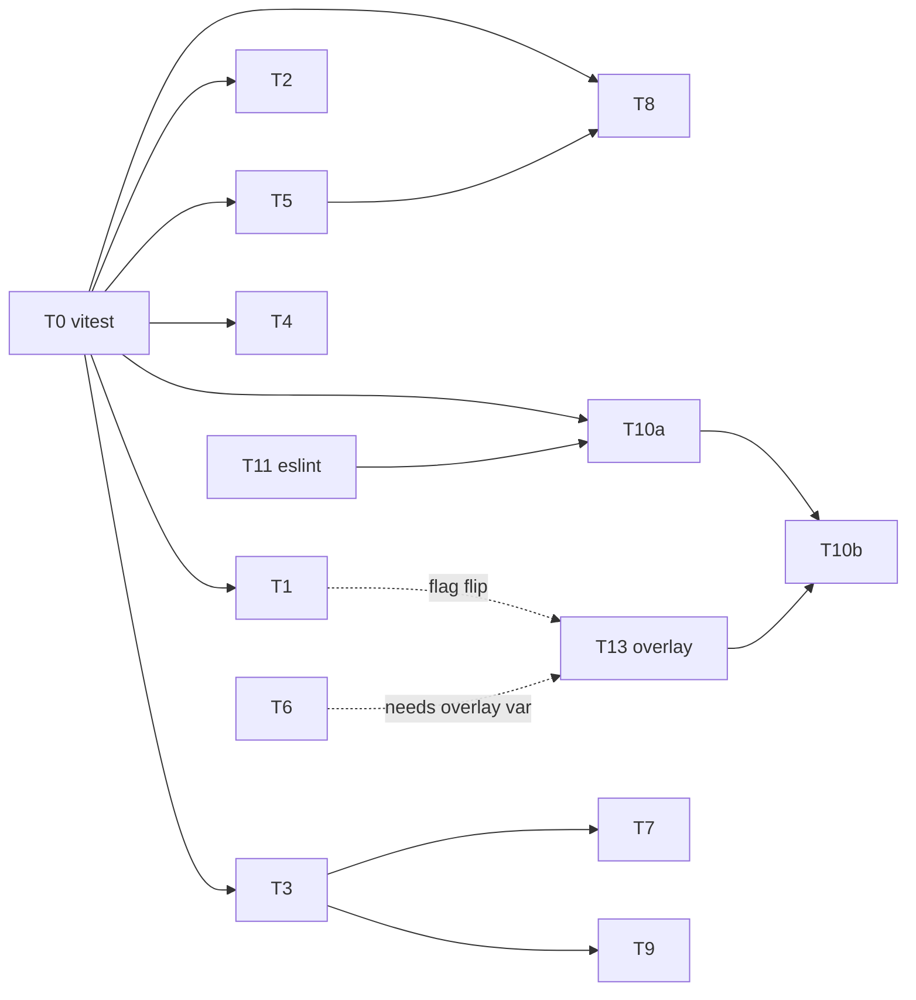

# Critical Fix Plan — `findings.md` P0 + tenant-isolation P1

**Status:** plan only. No code changed.
**Source:** `findings.md` (code review, 48k LOC, HEAD `cb03755`).

**Repos.** `wssca/breed_club` is the **public OSS package** — other clubs consume it. `wssca/deploy` is WSSCA's **private instance repo**: it downloads a tagged release tarball, overlays club-specific config, and deploys to Cloudflare. That split is not cosmetic — it changes the severity of one finding and exposes another the review missed (§2).

Every line reference below was re-verified against the working tree before writing. Where this plan contradicts `findings.md`, the contradiction is stated inline with evidence.

---

## 1. Scope

**P0 — exploitable or broken today**

| ID | Finding | Severity |
|---|---|---|
| T1 | `db.transaction()` unsupported on `neon-http` (#1) | **Latent, not live** — prod never enables the neon driver (§2) |
| T2 | Stored XSS ×2 on unauthenticated SSR/SVG routes (#2) | Exploitable now |
| T3 | Stripe metadata client-controlled → fee bypass, cross-owner write, no idempotency (#3) | Exploitable now |
| T4 | Ballot stuffing via non-transactional vote insert (#4) | Exploitable now |
| T5 | PII IDOR ×3 (#5) | Exploitable now |
| T6 | CORS reflects any origin with `credentials: true` | Exploitable now |
| T13 | No cron trigger in any deployed environment (**not in `findings.md`**) | Broken now — silent |

**P1 promoted** — same code paths as the P0 work; leaving them yields a half-fix.

| ID | Finding | Why promoted |
|---|---|---|
| T7 | Paid vs unpaid clearance creation diverge (#10) | T3 rewrites the exact webhook block; fixing twice is waste |
| T8 | Missing `club_id` predicate — 3 handlers + 2 admin queues (#11) | Cross-tenant exposure, same class as T5 |
| T9 | 12 fire-and-forget `recompute*().catch(() => {})` (#9) | T3/T7 add two more call sites; fix the idiom once |

**Enablement** — lands first (§4). There is no enforcement layer at all today.

| ID | Item |
|---|---|
| T0 | `vitest` harness in `api/` + integration harness against local PG |
| T10a | CI gate in `breed_club` — the repo has **no `.github/` directory** |
| T10b | Deploy ordering, dry-run, wrangler pin in `deploy` |
| T11 | `eslint.config.js` for `api/` and `app/` — 9 deps already installed, 0 configs exist |
| T12 | Purge every Supabase reference (config + docs, 3 repos) |

**Out of scope** (tracked, §10): #6 scoring default, #7 rating-category weights, #8 pedigree cycles + missing FKs, #12 frontend query keys, #13 LLM guardrails, migration-snapshot repair, god-file splits, duplication cleanup, non-Supabase doc corrections, perf work.

---

## 2. Repo boundaries and environment facts

### The package/instance split changes two findings

All three deploy workflows overwrite the package's wrangler config before deploying:

```
cp breed_club/wrangler.toml breed_club_src/api/wrangler.toml
```
`deploy-dev.yml:57`, `deploy-stage.yml:40`, `deploy-production.yml:35`

**`breed_club/api/wrangler.toml` is therefore a local-dev default and a downstream template. Nothing in it reaches WSSCA production.** Reading the overlay (`deploy/breed_club/wrangler.toml`, 61 lines) gives two results:

1. **`USE_NEON_DRIVER` is absent from the overlay.** `getDb` tests `envOrDb.USE_NEON_DRIVER === "true"` (`api/src/db/client.ts:49`), so production falls through to **postgres.js**, which supports transactions.
   `findings.md` #1 — *"two endpoints are hard-down in prod right now"* — is **incorrect**. The reviewer read `breed_club/api/wrangler.toml:25`, a file overwritten at deploy time. `DELETE /api/admin/dogs/:id` and batch clearance submit work today.
   T1 stays in scope as a landmine: the `as unknown as Database` cast at `client.ts:35` lies to the compiler, and the day anyone sets that var two endpoints break. It does **not** outrank T2/T3/T5.
   **One check falsifies this:** `wrangler secret list --name breed-club-api`. A secret of that name would override the analysis; the documented secret list (`deploy/README.md:66-71`) does not include it.

2. **`[triggers]` is absent from the overlay.** The package declares `crons = ["0 * * * *"]` (`api/wrangler.toml:32-33`) and `api/src/index.ts:154` implements `scheduled()`, but no deployed environment has a trigger. **The hourly `health_statistics_cache` refresh has never run in production.** A live defect `findings.md` missed → T13.
   The overlay also omits `LLM_PROVIDER` / `LLM_MODEL_*`. Harmless: `lib/llm/index.ts:38-39` and `routes/dogs.ts:1358-1360` supply identical defaults in code.

### Boundary rules binding every task below

- **Nothing WSSCA-specific lands in `breed_club`.** No `whiteswissshepherd.org` hostnames, no account IDs. T6 reads its CORS allow-list from an env var.
- **Anything added to `breed_club/api/wrangler.toml` must be mirrored into `deploy/breed_club/wrangler.toml` or it does not ship.** That is the drift class T13 closes permanently.
- **The enforcement gate belongs in `breed_club`, not `deploy`.** `deploy` only ever sees an already-tagged tarball; gating there catches a bad commit days late and helps no downstream club. Hence T10a/T10b.
- **`breed_club` docs serve any club.** T12 genericizes; it does not swap one hard-coded vendor for another.

### Database facts

**WSSCA production is Neon.** The project started on Supabase and migrated; the Supabase strings on disk are dead. Verified against installed packages:

- `drizzle-orm@0.38.4` ships `drizzle-orm/neon-serverless`; its `drizzle()` takes a `Pool` from `@neondatabase/serverless` and returns `NeonDatabase & { $client: Pool }` (`neon-serverless/driver.d.ts:1,24-37`). WebSocket `Pool` supports real transactions.
- `@neondatabase/serverless@1.0.2` is already a direct dependency and exports `Pool` and `neonConfig` (`index.d.ts:780,446`). **No new dependency needed.**
- `$client` exists on the postgres-js driver too (`postgres-js/driver.d.ts:23`), so `findings.md`'s *"postgres.js client created per request and never closeable"* is **stale** — `db.$client.end()` works. Folded into T1.
- **Keep both drivers.** `USE_NEON_DRIVER` is the package's portability seam; a downstream club on plain Postgres needs the postgres.js path. T1 swaps `neon-http` → `neon-serverless`; it does not collapse the branch.

**Human-only, cannot be delegated:**

- `deploy-stage.yml:54,60` feeds migrations from `secrets.SUPABASE_SESSION_URL_STAGE` while dev and prod use `DATABASE_URL_{DEV,PROD}`. If stage is still on Supabase, stage and prod run different database engines and stage validates nothing.
- Revoke the `sb_secret_…` service-role key and pooler password still in `api/.dev.vars.supabase`.

---

## 3. Model routing policy

Goal is **fewest errors per dollar**, not fewest dollars. Split by *decision density*, not line count.

| Tier | Models | Use for | Hard rule |
|---|---|---|---|
| **A — reasoning** | `anthropic/claude-opus-5`, `gpt-5` (high reasoning) | Security-boundary redesign, driver/transaction semantics — anywhere a wrong-but-plausible answer ships an exploit | Authors T1, T3. Reviews **every** task touching `payments.ts`, `middleware/auth.ts`, `middleware/rbac.ts`, `db/client.ts`, or a deploy workflow |
| **B — capable** | `anthropic/claude-sonnet-4.6`, `zai/glm-4.6` | Local refactors with a known-correct target shape; multi-file, single-concept | Authors T0, T2, T4, T7, T9 |
| **C — cheap/mechanical** | `anthropic/claude-haiku-4.5`, `zai/glm-4.5-air`, Cursor free tier (`composer-1`, `grok-code-fast-1`) | Pattern replication against a pre-written spec; config scaffolding; repetitive predicate insertion; docs purges | Authors T5, T6, T8, T10a, T10b, T11, T12, T13. **Never** invents a guard — copies a named pattern |

### Guardrails that make Tier C safe here

1. **Spec before code.** Every Tier-C task names the exact file, line, and the *verbatim* pattern to copy from an existing correct site. No task says "add appropriate auth."
2. **One file per Tier-C agent.** Concurrent same-file edits are not merge-safe.
3. **Machine gate before human review.** Tier C runs `npm run typecheck` in both workspaces plus the specific vitest file in its acceptance criteria. Cheap models are good at making a red test green and bad at deciding which test should exist — so T0 lands first and Tier B writes the tests.
4. **Tier-A review is mandatory on T5** even though Tier C authors it. The insertion is mechanical; the consequence is not.
5. **No Tier-C model runs `db:push`, edits migrations, or touches `drizzle/meta/`.** The snapshot chain is already corrupt (§10); a mechanical model regenerating it is how you lose prod.
6. **Cursor free models only on T10a/T11** (YAML, flat config). Weakest on type-level TypeScript and multi-hunk edits.

---

## 4. Phase 0 — enablement

Today: **0 test files, 0 runners, 0 `test` scripts, 0 eslint configs, no `.github/` in the package.** Verified — `find` for `*.test.ts`/`*.spec.ts` returns empty, `npm run lint` exits 2 with "Could not find config file" in both workspaces. Cheap models are only safe behind a mechanical gate, so the gate is built first.

### T0 — vitest harness

- **Model:** Tier B (`sonnet-4.6`). Fixture strategy needs judgment; not worth Tier A.
- **Files:** `api/package.json` (add `vitest`, `"test": "vitest run"`), `api/vitest.config.ts`, `api/src/test/setup.ts`, `api/src/test/db.ts`.
- **Change:**
  - Unit project — pure functions, no DB: `lib/rating.ts`, `lib/scoring.ts`, `shared/src/roles.ts`.
  - Integration project — real Postgres on `localhost:5433` (the `make up` compose stack), migrations applied, per-test transaction rollback. Required: T1, T3, T4, T7, T8 are all database-behaviour bugs a mocked `db` cannot prove.
  - Helper `withClub()` seeding two clubs and two members, so cross-tenant assertions are expressible.
- **Acceptance:** `npm run --workspace=@breed-club/api test` green with a smoke test that opens a transaction, inserts a dog, rolls back. Integration project **skips** (not fails) when `DATABASE_URL` is unset, so CI can stage it.
- **Risk:** low. Additive.

### T11 — eslint configs

- **Model:** Tier C (Cursor free / `glm-4.5-air`).
- **Files:** `api/eslint.config.js`, `app/eslint.config.js`.
- **Change:** flat config from already-declared deps. `api`: `@eslint/js` + `typescript-eslint`. `app`: same plus `eslint-plugin-react-hooks` and `eslint-plugin-react-refresh`. `react-hooks/rules-of-hooks` at `error` (the d69b235 bug class), `react-hooks/exhaustive-deps` at `warn`.
- **Acceptance:** `npm run lint` exits 0 in both workspaces. **Zero `--fix` runs** — do not let a cheap model mass-rewrite 48k LOC. Record the warning count in the PR body.
- **Risk:** low, provided autofix stays off.

### T10a — CI gate in the package repo

- **Model:** Tier C (`haiku-4.5` / Cursor free); Tier B reviews.
- **Files:** new `breed_club/.github/workflows/ci.yml`.
- **Change:** on `pull_request` and `push: tags: ['v*']` — `npm ci` (**not** `npm install`; all three deploy workflows use `npm install`, so the lockfile is currently decorative), then `npm run typecheck`, `npm run lint`, `npm run --workspace=@breed-club/api test`. Postgres service container on 5433 so T0's integration project actually runs. Node 20, matching deploy.
- **Also add:** `wrangler deploy --dry-run` against the package's own `api/wrangler.toml`. That bundling step is the only thing between a syntax error and production today — `wrangler deploy` never type-checks.
- **Acceptance:** a PR carrying a deliberate type error is blocked. A tag push runs the same gate, so `deploy` can only consume a green release.
- **Risk:** low. Purely additive to a repo with no CI; benefits every downstream fork.

### T10b — deploy ordering in the instance repo

- **Model:** Tier C authoring; **Tier A review** — production deploy path.
- **Files:** `deploy/.github/workflows/deploy-{dev,stage,production}.yml`.
- **Change:**
  1. `deploy-app` gets `needs: [deploy-api]`. Today they run fully in parallel (`deploy-production.yml:11,64`), so a frontend can go live against an API that failed to deploy.
  2. Migrations + seed (`deploy-production.yml:45,51`) move **after** a successful `wrangler deploy --dry-run`. Today they mutate the production database before any validation, with no rollback.
  3. Pin wrangler: `npx wrangler@4` (`deploy-production.yml:59`, `deploy-stage.yml:64`) → the version the package locks (`3.114.17`). A floating major on the deploy path is how a working release stops deploying.
  4. Assert the release tag's CI run was green (`gh run list --repo …/breed_club --commit <sha>`), making T10a load-bearing rather than advisory.
  5. Add the overlay drift check from T13.
- **Acceptance:** a dry-run failure blocks migrations; a tag whose CI never passed is refused.
- **Risk:** medium. Exercise on `deploy-dev.yml` first, then port.

### T13 — wrangler overlay drift (prod has no cron)

- **Model:** Tier C for the config edit; **Tier A review** on the drift check, which defines "in sync."
- **Verified state:** §2. `scheduled()` exists at `api/src/index.ts:154`; no deployed environment has a trigger.
- **Change:**
  1. Add `[triggers] crons = ["0 * * * *"]` to `deploy/breed_club/wrangler.toml`, including `env.staging` / `env.production` blocks if Cloudflare requires per-env declaration.
  2. Decide `USE_NEON_DRIVER` explicitly instead of by omission. Prod is Neon, so **after T1 ships** set it `"true"` in the production block — and only then does T1's fix become load-bearing. Order: T1 merges → release tagged → flag flipped as its own deploy. Never flip it on a release still using `neon-http`.
  3. Drift check (lands in T10b): parse both TOMLs, diff the `vars` key sets and `triggers`. Fail on a key present in the package template and absent from the overlay. Value differences are expected and must not fail; **missing keys** are the bug class.
- **Acceptance:** `wrangler deployments list` shows the cron trigger; `health_statistics_cache.updated_at` advances within the hour. The drift check fails when a var is removed from the overlay on a scratch branch.
- **Risk:** low for the cron. The `USE_NEON_DRIVER` flip is high-risk and is really a T1 rollout step — treat it as one.

### T12 — purge every Supabase reference

- **Model:** Tier C (`haiku-4.5` / Cursor free). Find-and-replace against an exhaustive inventory. **Exception:** the `deploy-stage.yml` hunk gets Tier A review — it may be load-bearing rather than stale.
- **Why:** Supabase is decommissioned but still documented as live across three repos. A club adopting the package follows `README.md`, provisions a Supabase project and a Storage bucket the code never touches, and wires two secrets the API never reads. **Zero source files reference it** (`grep -ri supabase api/src app/src shared/src` → 0 hits), so this is config + docs only and cannot break the build.
- **Boundary rule:** genericize, don't re-pin. Write "any managed PostgreSQL provider," use Neon as the worked example, note that `USE_NEON_DRIVER` optimizes for it. WSSCA hosts and account IDs stay in `deploy/`.
- **Exhaustive inventory** (counts exclude `node_modules`, verified by `grep -ric`):

  | File | Hits | Action |
  |---|---:|---|
  | `README.md` | 22 | `:13` Database → "PostgreSQL (any provider)"; `:14` "Supabase Storage" → **Cloudflare R2** (`CERTIFICATES_BUCKET`, `wrangler.toml:35-37`); `:40` prerequisite → a Postgres provider; `:58-93` replace the entire "Set Up Supabase" section with provider-neutral "create a database, copy the connection string"; `:184` secret note; **delete** `:196-201` (`SUPABASE_URL` / `SUPABASE_SERVICE_KEY` — the API never reads either); `:244-246` env sample → the Neon string already in `.env.example:7` |
  | `docs/architecture.md` | 8 | `:5`, `:51`, `:52`, `:283`, `:423`, `:501`, `:507`, `:598`. Note `:423` documents `lib/storage.ts`, **which does not exist** — `api/src/lib/` has no storage module; uploads go through R2 in `routes/uploads.ts` |
  | `Makefile` | 7 | Delete `db-sync` (`:29-33`) and `use-supabase-db` (`:46-48`); drop both from `.PHONY` (`:6`). `use-local-db` stays |
  | `AGENTS.md` (parent repo `wssca/`) | 3 | `:41`, `:46` reference the deleted make targets; `:53` references `.dev.vars.supabase` |
  | `docs/segments.md` | 2 | `:25`, `:46` — historical build plan; rewrite to "Postgres", don't delete the narrative |
  | `.gitignore` | 1 | `:36` → `.dev.vars*`, which also closes the `.dev.vars.prod` leak |
  | `deploy/.github/workflows/deploy-stage.yml` | 2 | `:54`, `:60` `SUPABASE_SESSION_URL_STAGE` → `DATABASE_URL_STAGE`, matching dev/prod. **Instance-side: the secret must exist first and someone must confirm stage is on Neon** |
  | `api/.dev.vars.supabase` | — | Delete (untracked). Revoke the key first |
  | root `.env` | — | Delete the commented Supabase block (untracked, local only) |
  | `findings.md` | 2 | **Leave unchanged.** Dated review artifact; rewriting its evidence destroys the audit trail |

- **Also in `Makefile`:** `test-neon` (`:~50`) already does exactly what T1 needs for manual verification — `USE_NEON_DRIVER=true DATABASE_URL=$(NEON_DB_URL) npx wrangler dev`. After T1 its help text ("neon-http driver") is wrong. Rename to `dev-neon`, fix the comment. Sequence after T1, or hand that one line to T1's owner.
- **Acceptance:** `grep -ri supabase . --exclude-dir=node_modules --exclude=findings.md --exclude=critical-fix-plan.md` → 0 hits in `breed_club/`, 0 in `wssca/AGENTS.md`, 0 in `deploy/`. `make up && make db-setup && npm run dev` still works. Typecheck unaffected.
- **Risk:** low for docs; **medium for `deploy-stage.yml`** — a missing `DATABASE_URL_STAGE` breaks the stage deploy. Merge that hunk only after the secret exists.

---

## 5. Phase 1 — P0 fixes

### T1 — `db.transaction()` on the neon driver

- **Model:** **Tier A.** Driver semantics plus a deliberate `as unknown as` type-lie whose removal must be allowed to fail the compiler.
- **Blocked by:** nothing. Pair with T0 only if the integration tests should land in the same PR.
- **Files:** `api/src/db/client.ts`, `api/src/routes/admin.ts:449`, `api/src/routes/health.ts:539`.
- **Verified state:**
  - `client.ts:35` — `(await createNeonDb(connectionString)) as unknown as Database`, where `Database = Awaited<ReturnType<typeof createPostgresDb>>` (`client.ts:43`). The cast hides the defect.
  - `admin.ts:449` — `DELETE /api/admin/dogs/:id`: 6 statements + `logDogDeletion` + hard delete inside `db.transaction`. Already launders types: `logDogDeletion(tx as unknown as Database, …)`.
  - `health.ts:539` — batch clearance submit, no-payment path, N inserts in one transaction.
  - `getDb(envOrDb: any)` at `client.ts:45` — untyped accessor.
- **Change:**
  1. `drizzle-orm/neon-http` → `drizzle-orm/neon-serverless`; `neon(connectionString)` → `new Pool({ connectionString })`. `drizzle(pool, { schema: schemaObj })` yields a `NeonDatabase` with working `.transaction()`.
  2. **Delete `cachedNeon` (`client.ts:13,32-36`).** That cache is only sound for stateless HTTP; a WebSocket `Pool` holds a live socket and Workers forbid reusing an I/O object across requests. Create per request.
  3. Close it: `c.executionCtx.waitUntil(db.$client.end())` in the db middleware's response path. `$client` is typed on both drivers, so one teardown covers the postgres.js dev path too — this retires the "never closeable" perf finding.
  4. Determine empirically whether `neonConfig.webSocketConstructor` needs assigning. Workers expose a global `WebSocket` and the driver should self-configure; set it only if the first run throws on socket construction. Do not guess up front.
  5. Remove the `as unknown as Database` cast. Redefine `Database` as the union of both drivers' types so a driver lacking `.transaction` is a **compile error**, and retype `getDb` to `(source: Env | Database)`.
  6. With the union in place, `logDogDeletion(tx as unknown as Database, …)` should typecheck without the cast — delete it. If it doesn't, widen `logDogDeletion` to accept a transaction handle; do not re-add the cast.
  7. `admin.ts:449` and `health.ts:539` need **no logic change**. They were always correct; the driver was not. Verify only.
- **Acceptance:**
  - `npm run --workspace=@breed-club/api typecheck` passes **with the cast deleted**.
  - Integration: `DELETE /api/admin/dogs/:id` under the neon driver completes; when the final delete throws, `litters.sire_id` is unchanged (proves real rollback).
  - Integration: batch clearance submit with one invalid item inserts **zero** rows.
  - Manual: `make test-neon` against a Neon branch; exercise both endpoints.
- **Risk:** **high when it ships, zero on merge.** The overlay never sets `USE_NEON_DRIVER` (§2), so merging changes nothing in production until T13 flips the flag. Exploit that: land T1, release, verify against a Neon branch, *then* flip the flag as its own deploy with a rollback tag. Never batch the flip.

### T2 — stored XSS in `health-stamp.ts`

- **Model:** Tier B (`sonnet-4.6` / `glm-4.6`). Template-shape refactor with a well-defined target, ~120 lines of interpolation.
- **Files:** `api/src/routes/health-stamp.ts` only.
- **Verified state:**
  - Mounted at `/` with only `clubContext` (`index.ts:107`) — **no auth**.
  - 4 `raw()` sites: `:432`, `:433`, `:434`, `:450`. The `:450` site is the reduce-built table carrying `test.short_name` and `test.result`.
  - `:568` region — SVG served as `image/svg+xml` (an active content type) interpolating `dog.registered_name` via `displayName` (`:520-522`).
  - `result` is `z.string().min(1).max(100)` (`validation.ts:134`) and reaches the DB unmodified when the org link has no `result_schema`.
  - **Correction to `findings.md`:** both queries **are** club-scoped — `:72` and `:504` carry `eq(dogs.club_id, club.id)`. What is genuinely missing is any `status`/`is_public` filter. `dogs.is_public` (`schema.ts:204`, default `false`) and `dogs.status` (`schema.ts:210`, default `"pending"`) both exist.
- **Change:**
  1. Delete all 4 `raw()` calls; compose nested `hono/html` tagged-template fragments so interpolations auto-escape. For `:450`, build an array of `html\`…\`` fragments and interpolate the array (hono/html joins arrays without re-escaping fragments).
  2. Add a local `escapeXml()` (`& < > " '`) applied to every SVG interpolation including `displayName`. Truncate **before** escaping, or a severed entity breaks the document.
  3. Add `and(eq(dogs.status, "approved"), eq(dogs.is_public, true))` to the queries at `:72` and `:504`.
  4. Response headers on both routes: `Content-Security-Policy: default-src 'none'` (add `style-src 'unsafe-inline'` only if the page keeps its inline `<style>`) and `X-Content-Type-Options: nosniff`.
- **Acceptance:**
  - Unit: `result` = `</td><script>alert(1)</script>` renders `&lt;script&gt;`, and the body contains no `<script` substring.
  - Unit: `registered_name` containing `"><script>` yields an SVG with no `<script` and no unbalanced quote.
  - Integration: a `status: "pending"` or `is_public: false` dog returns 404 from both routes.
  - Manual: `curl` both routes, grep the body.
- **Risk:** medium-low, but item 3 is **behaviour-visible** — badge links for non-public/pending dogs start 404ing. Confirm with the product owner; if unacceptable, gate on `is_public` alone and file `status` separately.

### T3 — Stripe metadata trust boundary

- **Model:** **Tier A.** Three compounding defects on the money path, plus an idempotency guard that must be a single conditional `UPDATE … RETURNING`.
- **Files:** `api/src/routes/payments.ts`, `shared/src/validation.ts:410`.
- **Verified state:**
  - `payments.ts:138-145` — `metadata: { payment_id, club_id, member_id, resource_type, ...metadata }`, client spread **last**, so every server field is overridable.
  - `validation.ts:410` — `metadata: z.record(z.unknown())`.
  - `payments.ts:300` — `const clearanceData = payment.metadata as any;` then `insert(dogHealthClearances).values({ dog_id: clearanceData.dog_id, … })` with **no** `isDogOwner` and **no** `club_id` check. The direct path enforces both (`health.ts:290-297`).
  - No `payment.status === "completed"` check before resource creation → Stripe's at-least-once delivery duplicates rows.
  - `payment.metadata as any` at `:227`, `:300`, `:323`.
- **Change:**
  1. **Never spread client metadata into Stripe.** Stripe metadata carries `{ payment_id }` only; everything else is read from the `payments` row in the webhook.
  2. Replace `z.record(z.unknown())` with a discriminated union on `resource_type` (`dog_create` | `clearance_submit` | `clearance_batch_submit`), each arm listing exactly the fields the webhook consumes. Persist the **parsed** object. Type the read side with the same union, killing all three `as any`.
  3. `resource_type` comes from the `payments` row, never from `session.metadata`.
  4. **Idempotency:** before creating anything, `UPDATE payments SET status='completed', completed_at=now() WHERE id=$1 AND status <> 'completed' RETURNING *`. Zero rows → already processed → `return c.json({ received: true })`.
  5. **Ownership re-check:** for both clearance arms, re-load the dog by `(id, club_id)` from the payment row's `club_id` and re-run `isDogOwner(...)` against `payment.member_id`. Mismatch → log and return `received: true`; never 500 at Stripe, a retry storm won't help.
- **Acceptance:**
  - Integration: replaying an identical `checkout.session.completed` twice creates exactly one clearance.
  - Integration: a 500¢ `clearance_submit` payment whose session metadata claims `resource_type: "dog_create"` creates **no dog**.
  - Integration: a clearance payload naming another member's dog creates **no clearance**, returns 200.
  - Typecheck passes with zero `as any` in `payments.ts`.
- **Risk:** **high.** Payment path. Requires a Stripe CLI replay (`stripe listen --forward-to localhost:8887/api/payments/webhook`) against local PG before merge.

### T4 — ballot stuffing

- **Model:** Tier B (`sonnet-4.6`). Small and well-scoped, but dedup semantics (reject vs. collapse) is a real decision.
- **Files:** `api/src/routes/voting.ts:632-648`, `shared/src/validation.ts:479-484`.
- **Verified state:** the comment at `voting.ts:632` says "in a transaction." It is two bare `db.insert()` calls. `castBallotSchema` is `z.array(...).min(1)` with no uniqueness refinement. The pre-check at `:620-630` correctly rejects prior participation, so the only hole is intra-request duplication: `idx_vote_participation_unique` (`schema.ts:872`) aborts the *second* insert, leaving weighted `vote_records` committed and no participation row → repeatable indefinitely.
- **Change:**
  1. `.superRefine` on `castBallotSchema`: `question_id` unique across the array, else 400. Reject rather than silently collapse — a duplicate is a client bug or an attack, and collapsing hides both.
  2. Wrap both inserts in `db.transaction`. Safe on today's prod driver (postgres.js, §2); becomes dependent on T1 the moment `USE_NEON_DRIVER` is flipped, so **T1 must merge before T13 flips the flag** — not before T4.
  3. Insert `vote_participation` **before** `vote_records` so the unique index fires first.
- **Acceptance:**
  - Unit: `castBallotSchema` rejects `[{q1,optA},{q1,optB}]`.
  - Integration: 50 identical votes → 400, `vote_records` count 0.
  - Integration: forced failure on the second insert leaves `vote_records` at 0.
- **Risk:** low.

### T5 — PII IDOR ×3

- **Model:** Tier C (`haiku-4.5` / `glm-4.6`) — pattern replication. **Tier A review mandatory** before merge.
- **Files:** `api/src/routes/applications.ts:208`, `api/src/routes/health.ts:1032`, `api/src/routes/members.ts:243`.
- **Verified state:**
  - `applications.ts:208` `GET /:id` — `requireAuth` only. Club-scoped, but any authenticated user (self-registration is open, `members.ts:59`) reads any application's name, email, phone, address, answers.
  - `health.ts:1032` `GET /dogs/:dog_id/conditions` — no `requireAuth`, no member check, club-scoped dog lookup only. Every sibling handler in the file opens with `if (!club || !auth?.member) throw unauthorized()`.
  - `members.ts:243` `GET /directory` — no auth; `db.query.members.findMany({ where, with: { contact: true } })` with **no `columns` projection**, returning whole `members` rows including `clerk_user_id`, `is_admin`, permission flags, `skip_fees`.
- **Change (exact, no latitude):**
  1. `applications.ts:208` — add `requirePermission("members:approve")` **or** an owner check (`application.member_id === auth.member.id`), whichever matches the real caller. *Resolve before dispatch* by grepping `app/src` for the fetch of `/applications/:id`; hand the Tier-C agent the answer as a fact.
  2. `health.ts:1032` — prepend the file's canonical guard: `const auth = c.get("auth"); if (!club || !auth?.member) throw unauthorized();`. Filter to `status = 'approved'` unless the caller is the dog owner or holds `health:verify`.
  3. `members.ts:243` — add an explicit `columns: {…}` allow-list (id, display name, city/state, breeder fields, contact subset). Anything `app/src/pages/DirectoryPage.tsx` doesn't consume isn't returned. It stays public — it is a public breeder directory — but stops shipping auth internals.
- **Acceptance:**
  - Integration per endpoint: unauthenticated / wrong-member → 401/403.
  - Integration: `/directory` objects contain no `clerk_user_id`, `is_admin`, `skip_fees`, or permission keys.
  - Frontend smoke: directory page and application detail still render under `npm run dev`.
- **Risk:** medium — can break a legitimate caller. The frontend smoke test is not optional.

### T6 — CORS

- **Model:** Tier C (`haiku-4.5`).
- **Files:** `api/src/index.ts:38-44`, `api/src/lib/types.ts` (Env), `deploy/breed_club/wrangler.toml`.
- **Verified state:** `origin: (origin) => origin, // TODO: restrict to app domain in production` with `credentials: true` — reflects any origin, so any site can make credentialed cross-origin calls.
- **Change:** env-driven allow-list, **no WSSCA hostnames in the package** (§2). Read comma-separated `CORS_ORIGINS` from `Env`, parse once at module scope, exact-match. Unknown origin → omit the header entirely, do not echo. Package default when unset: localhost dev origins only. WSSCA's real domains go in the overlay `[vars]` per environment — so **T6 is not done until the overlay carries the var**, or prod CORS breaks. Pair the merge with T13's overlay edit. Verify the dev port against `app/vite.config.ts`: README says 5173, the wrangler `[dev]` block says 8887, `findings.md` claims the real pair is 5273/8887.
- **Acceptance:** `curl -H 'Origin: https://evil.test' -i …/api/health` returns **no** `Access-Control-Allow-Origin`; the app still loads from the real origin.
- **Risk:** low mechanically, **high blast radius if the list is wrong** — one missing origin breaks the whole SPA. Ship to dev first and load the app.

---

## 6. Phase 2 — tenant isolation and webhook parity

### T7 — one `createClearance()` for paid and unpaid paths

- **Model:** Tier B (`sonnet-4.6`).
- **Blocked by:** T3 (rewrites the webhook block).
- **Files:** new `api/src/lib/clearances.ts`; callers `health.ts:347-350,539+`, `payments.ts:302-316`.
- **Verified state:** the unpaid path calls `computeResultSummary` + `computeResultScores` and honours `is_preliminary`; the webhook writes `result: clearanceData.result` raw, `result_score = NULL`, no `(Prelim)` marker. **Whether a submitter paid changes their dog's health rating.**
- **Change:** extract `createClearance(db, { clubId, dogId, item, certificateUrl, submittedBy })` doing the org-link `result_schema` lookup, summary, scores, prelim handling, and insert. Both paths call it; single and batch share one body.
- **Acceptance:** integration test asserting paid and unpaid produce byte-identical rows for the same input (excluding `id`/timestamps).
- **Risk:** medium. Existing NULL-score rows written by the paid path stay wrong until a backfill — file that as a separate data task.

### T8 — `club_id` predicates pushed into SQL

- **Model:** Tier C (`haiku-4.5` / `glm-4.5-air`). Mechanical once enumerated — it is.
- **Sites (all verified):**
  1. `health.ts:818-826` — clearance loaded by `eq(dogHealthClearances.id, clearanceId)` alone; the `dogs` lookup at `:829` is `eq(dogs.id, dogId)` with no `club_id`.
  2. `health.ts:918-924` — same shape, delete path.
  3. `voting.ts:305-310` — `memberVotingTiers.findFirst({ where: eq(member_id, memberId) })`, no club scope, behind `requireLevel(100)`: an admin of club A can delete club B's assignment.
  4. `admin.ts:854` — `const where = eq(dogHealthClearances.status, "pending")`, club filter applied only in JS at `:917`. Note `:911-913` **already** joins `dogs` with the club predicate for the count, so the count and the page disagree.
  5. `admin.ts:1300-1311` — transfers queue: `.filter(t => t.dog?.club_id === clubId)` then `meta: { total: filtered.length, pages: 1 }`, which makes the queue unpaginable.
- **Change:** add `eq(dogs.club_id, clubId)` / `innerJoin(dogs, and(…, eq(dogs.club_id, clubId)))` to each query; delete the JS `.filter(...)`; restore real `total`/`pages` from the count query in 4 and 5.
- **Acceptance:** integration test per site — a club-B row is invisible to a club-A admin. For 4 and 5, `meta.total` equals the DB count and `meta.pages > 1` with two pages of fixtures.
- **Risk:** low. Fully specified and test-gated.

### T9 — `waitUntil` for fire-and-forget recomputes

- **Model:** Tier B (`sonnet-4.6`). 12 sites, but some sit in helpers with no `c` in scope, so it requires threading an `ExecutionContext`. Not blind sed.
- **Files:** 12 `recomputeHealthRating(db, dogId).catch(() => {})` sites across `health.ts`, `payments.ts`, `admin.ts`, plus `rating.ts:517` `recomputeAllClubRatings`.
- **Verified state:** the correct idiom already exists at `admin.ts:986` — `c.executionCtx.waitUntil(...)`.
- **Change:** `c.executionCtx.waitUntil(recomputeHealthRating(db, dogId).catch((e) => console.error("recompute failed", { dogId, e })))`. Thread an `ExecutionContext` where `c` is unavailable. `catch(() => {})` is deleted everywhere — log or rethrow.
- **Acceptance:** `grep '.catch(() => {})' api/src` → 0. Typecheck passes. Manual: approve a clearance in dev, observe `dogs.health_rating` change.
- **Risk:** low — but note `recomputeAllClubRatings` (≥6 queries × N dogs, sequential) will now reliably run and may exceed Worker CPU limits on a large club. `waitUntil` fixes correctness and *exposes* the perf bug. Flag it; don't fix it here.

---

## 7. Sequencing and file-conflict map

Concurrency is bounded by file ownership, not agent count. Same-file concurrent edits are not merge-safe.



| Wave | Tasks | Files | Notes |
|---|---|---|---|
| **0** | T0, T11, T10a, T12, T13 | `api/package.json`, `vitest.config.ts`, `*/eslint.config.js`, new `breed_club/.github/`, docs + `Makefile` + `.gitignore`, `deploy/breed_club/wrangler.toml` | Fully parallel, no shared files. **Ship T13's cron fix first and alone** — it is the only live defect with a one-line fix. T12's `test-neon` rename waits on T1 |
| **1** | T1, T2, T3, T6 | `client.ts`+`admin.ts:449`+`health.ts:539` / `health-stamp.ts` / `payments.ts`+`validation.ts` / `index.ts`+`lib/types.ts` | Disjoint. Fully parallel |
| **2** | T4, T5 | `voting.ts` / `applications.ts`+`health.ts:1032`+`members.ts:243` | T5 rebases over T1's `health.ts` hunk — ~500 lines apart, no semantic overlap |
| **3** | T7, T9, T10b | `lib/clearances.ts`+`health.ts`+`payments.ts` / 12 sites / `deploy` workflows | T7 and T9 both touch `payments.ts`: same owner, sequential |
| **4** | T8 | `health.ts`, `voting.ts`, `admin.ts` | Last; rebases over everything |

**Deploy grouping.** `deploy` consumes tagged releases, so each group is a tag, not a push.

1. **T13 cron** — alone, fixes a live defect.
2. **T2 + T5 + T6** — security batch. T6 needs `CORS_ORIGINS` in the overlay in the same window.
3. **T3 + T7** — with a Stripe CLI replay in stage.
4. **T4 + T8 + T9**.
5. **`USE_NEON_DRIVER` flip** — its own deploy, rollback tag ready, only after T1 has shipped and been verified against a Neon branch.

T1 itself may ride in any batch; it is inert until step 5.

---

## 8. Review gates

| Task | Author | Reviewer | Extra gate |
|---|---|---|---|
| T0, T11 | B / C | B | — |
| T10a | C | B | Deliberate type error blocked on a scratch PR |
| T10b | C | **A** | Dry-run on `deploy-dev.yml` first |
| T12 | C | B; **A** for the `deploy-stage.yml` hunk | `grep -ri supabase` → 0; `make db-setup && npm run dev` works |
| T13 | C | **A** | Cron observed firing; flag flip deployed separately |
| T1 | **A** | **A** (second pass) + human | `make test-neon` against a Neon branch |
| T2 | B | **A** | `curl` payload inspection |
| T3 | **A** | **A** + human | Stripe CLI webhook replay in stage |
| T4 | B | B | — |
| T5 | C | **A** | Frontend click-through |
| T6 | C | B | Browser load from the real origin |
| T7 | B | **A** | Paid/unpaid row-equality test |
| T8 | C | B | Cross-tenant tests |
| T9 | B | B | — |

**Hard rule:** no Tier-C output merges into `payments.ts`, `middleware/auth.ts`, `middleware/rbac.ts`, `db/client.ts`, or any deploy workflow without Tier-A review, however mechanical the diff looks.

---

## 9. Definition of done

- [ ] `wrangler secret list --name breed-club-api` confirms `USE_NEON_DRIVER` is not set as a secret (validates §2)
- [ ] T13: cron trigger in the overlay and observed firing; `health_statistics_cache.updated_at` advancing hourly; drift check live in CI
- [ ] `breed_club/.github/workflows/ci.yml` exists and blocks a broken PR; `deploy` refuses a tag whose CI was not green
- [ ] `npm run --workspace=@breed-club/api test` green, including integration tests for T1–T5, T7, T8
- [ ] `npm run typecheck` green in both workspaces **with `as unknown as Database` deleted**
- [ ] `npm run lint` exits 0 in both workspaces
- [ ] `grep -c 'raw(' api/src/routes/health-stamp.ts` → 0; `grep -c '.catch(() => {})' api/src` → 0
- [ ] T12: `grep -ri supabase` (excluding `node_modules`, `findings.md`, this plan) → 0 across all three repos; service key revoked; `.gitignore` → `.dev.vars*`; stage confirmed on Neon via `DATABASE_URL_STAGE`
- [ ] No WSSCA hostname, account ID, or secret name added to `breed_club` by any task here
- [ ] Stripe webhook replayed twice in stage → one resource created
- [ ] Manual browser pass: directory, application detail, dog detail health tab, badge SVG, checkout
- [ ] `USE_NEON_DRIVER` flipped in the overlay as a standalone deploy, both transaction endpoints verified in prod

---

## 10. Deferred

`#6` scoring default, `#7` rating-category weights, `#8` pedigree cycles + missing self-FKs, `#12` query-key factory, `#13` LLM guardrails, migration-snapshot repair, god-file splits, `requireMember(c)` extraction (31 copies), perf items.

Doc corrections **other than the Supabase purge** stay deferred — README ports 5173/8787 vs actual 5273/8887, the non-existent `scripts/` dir, shadcn/ui, `techdebt.md`, `TIER_LEVEL` vs `DEFAULT_LEVELS`. Keeping T12 scoped to one vendor keeps its acceptance check a single mechanical grep.

**One deferred item is a landmine.** The next `drizzle-kit generate` will re-emit `CREATE UNIQUE INDEX` without `IF NOT EXISTS` and fail on every migrated database, because `0029_snapshot.json` disagrees with the SQL and 14 snapshots (0011–0022, 0030, 0031) are missing entirely. **No task in this plan needs a migration.** Any agent that concludes otherwise must stop and escalate.
